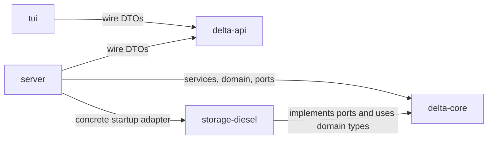
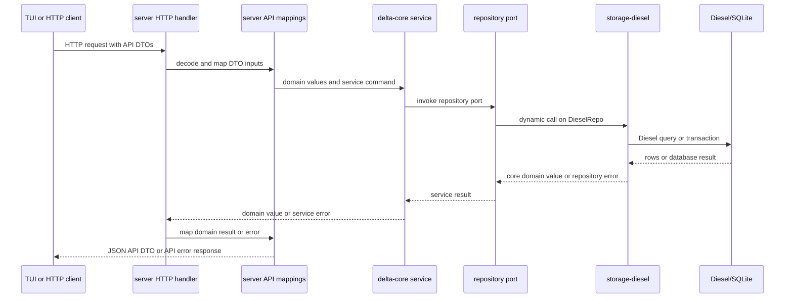

# Architecture

## Overview

DeltaBeer separates business behavior from transport, persistence, and presentation.
`delta-core` defines the domain model, application services, and ports used by those services.
`server` is the composition root for the HTTP application and selects the Diesel/SQLite adapter at startup.
`delta-api` defines the serializable wire contract shared by the `server` and the TUI.
The TUI is an HTTP client and presentation application, not another backend adapter.

The diagrams below distinguish compile-time crate dependencies from runtime calls.
An arrow in the dependency diagram means that the crate at the tail depends on the crate at the head in its Cargo.toml.

## Workspace components

| Crate            | Responsibility                                                                                                                                    | May depend on / boundary notes                                                                                                                         |
| ---------------- | ------------------------------------------------------------------------------------------------------------------------------------------------- | ------------------------------------------------------------------------------------------------------------------------------------------------------ |
| `delta-core`     | Domain values, domain errors, authentication and password behavior, policies, application services, and abstract repository/clock/id/token ports. | It has no dependency on the `server`, TUI, or `storage-diesel`. Its optional Diesel feature supplies Diesel error conversion used by `storage-diesel`. |
| `delta-api`      | Serializable request, response, identifier, transaction, statistics, and error DTOs for the HTTP contract.                                        | It is a wire-type crate. It does not depend on `delta-core` and contains no HTTP server or business service.                                           |
| `storage-diesel` | DieselRepo, SQLite pool construction, Diesel queries, row/model conversion, and migrations/schema support.                                        | It implements the repository ports from `delta-core`. SQL and blocking connection work stop at this adapter boundary.                                  |
| `server`         | Configuration loading, startup, dependency assembly, Axum routes and middleware, OpenAPI, HTTP error handling, and API/core conversion.           | It depends on `delta-api`, `delta-core`, and `storage-diesel`.                                                                                         |
| `tui`            | Terminal setup, input/scanner handling, dialogs, presentation state, localization, rendering, and asynchronous HTTP requests.                     | It depends on `delta-api`, but not on `server`, `storage-diesel`, or `delta-core`.                                                                     |
| `cli`            | Placeholder command-line binary that currently prints Hello, world!.                                                                              | It has no Cargo dependencies and is not part of the `server` or TUI runtime.                                                                           |

## Compile-time dependencies

The workspace-level crate dependency graph declared by the manifests is:

`server` -> `delta-api` and `tui` -> `delta-api` are transport-contract dependencies.
`storage-diesel` -> `delta-core` is the adapter dependency on the port and domain definitions it implements.
The `server` -> `storage-diesel` edge is a composition-time dependency used by `crates/server/src/main.rs` to build `DieselRepo`.
There is no compile-time `delta-core` -> `storage-diesel` edge.
There is no manifest dependency from `tui` to the `server` implementation, database adapter, or core domain.

## Runtime request flow

The normal HTTP path uses the server's handlers and mapping module before invoking a core service.
The repository port is the runtime interface seen by the service.
The `server` selects `DieselRepo` at runtime through the repository trait objects, rather than compiling `storage-diesel` into `delta-core`.

For writes such as spend and top-up, the Diesel adapter performs the balance update and transaction insert in one SQLite transaction.
The adapter reconstructs a core User, applies the core balance method, writes the resulting fields, and maps the inserted transaction back to a core transaction.
The response then travels from the service through the handler's mapping functions to delta-api DTOs and JSON.
Errors follow the same boundary direction: repository and service errors are converted to the server's ApiError, then to the shared ApiErrorResponse wire shape.

## TUI request and state flow

The TUI has its own application loop and state model.
Input handling and dialogs emit Message values in crates/tui/src/app/message.rs.
App::update in crates/tui/src/app/update.rs changes presentation state and turns an ApiRequest into an ApiCommand when a network call is needed.
Runtime::dispatch invokes crates/tui/src/api/execute.rs, which calls ApiClient in crates/tui/src/api/client.rs.
The client serializes requests using delta-api DTOs and sends HTTP with reqwest.
The result is decoded as a DTO, converted by crates/tui/src/api/mappings.rs into private models in crates/tui/src/model.rs, and returned as an ApiResult or AppError message.
App::update consumes that message, updates pages, dialogs, authentication state, or status, and the next render pass draws the resulting state.
The TUI communicates with the backend through HTTP and never opens a database connection.

## Mapping boundaries

Conversions are local to the boundary that owns each representation.

| Boundary               | Conversion location                     | Representations                                                                                                |
| ---------------------- | --------------------------------------- | -------------------------------------------------------------------------------------------------------------- |
| HTTP/`server` boundary | `crates/server/src/api/mappings.rs`     | `delta-api` DTOs ↔ `delta-core` domain/service values; server errors ↔ `ApiErrorResponse`                      |
| Storage boundary       | `crates/storage-diesel/src/mappings.rs` | Diesel rows/models ↔ `delta-core` domain values; `NewTransaction` also maps core transactions to insert models |
| TUI/API boundary       | `crates/tui/src/api/mappings.rs`        | `delta-api` DTOs ↔ TUI presentation models in `crates/tui/src/model.rs`                                        |

The server owns external token encoding.
`AdminToken` remains a core type at the service boundary, while `server/src/api/mappings.rs` encodes and decodes its 32 bytes as URL-safe base64 for the API.
The storage adapter persists token bytes and metadata without exposing its row types to the server or TUI.

## Ownership and boundary rules

Core services coordinate use cases and enforce application-level authorization, identity, and policy decisions through ports.
Core domain types own domain operations such as username normalization, password-hash validation, amount representation, and checked balance subtraction.

The storage adapter owns SQL queries, transactions, row validation, Diesel error translation, and SQLite-specific constraints.
It may call core domain methods while translating a repository operation, but it does not define a second public service API.

The server owns HTTP routing, middleware, status/error translation, JSON serialization, and API-to-core mapping.
API DTOs are wire representations and should not be used as substitutes for core domain values.

The TUI owns input, dialogs, authentication presentation state, page data, rendering, and client-side API error presentation.
It uses the HTTP API rather than reaching into the repository or database.
The placeholder cli binary currently owns no production behavior beyond its placeholder output.

## Important invariants

The following rules are supported by the current implementation and tests.

| invariant                                                                                     | enforcing layer                                                                                                                                                                                               |
| --------------------------------------------------------------------------------------------- | ------------------------------------------------------------------------------------------------------------------------------------------------------------------------------------------------------------- |
| Usernames are canonicalized to lowercase for lookup, creation, and update.                    | delta-core provides normalize_username and the user services apply it; storage-diesel also normalizes repository inputs and performs case-insensitive checks.                                                 |
| Amounts and card numbers use non-negative u32 application representations.                    | Core Amount and user fields use u32; API DTOs use u32; storage conversion rejects negative i64 values, and SQLite checks non-negative balances, spent amounts, transaction amounts, and bounded card numbers. |
| Spending cannot underflow a balance.                                                          | delta-core User::deduct_balance uses Amount::checked_sub; storage-diesel applies it before writing inside its transaction. Core service tests and repository tests cover the behavior.                        |
| A top-up transaction carries an approving user.                                               | The core Transaction::TopUp variant requires approved_by; the service passes the actor; the database transaction check requires approval and the SQLite trigger requires that approver to be an active admin. |
| Passwords are verified and stored as hashes, not as plaintext service values.                 | Password hashing and verification belong to delta-core; storage-diesel persists PasswordHash; the server transports credentials and never maps a password into a response DTO.                                |
| Tokens are opaque 32-byte core values with expiry and single-use/session metadata.            | Core token infrastructure issues and validates tokens through TokenRepo; storage-diesel persists and expires them; the server only performs external base64 encoding.                                         |
| Historical users, admin grants, transactions, and tokens cannot be freely deleted or mutated. | SQLite migrations define foreign keys, checks, and triggers for these history rules; storage integration tests exercise the schema behavior.                                                                  |

The database schema is an additional enforcement layer, not a replacement for core service checks.
For example, the active-admin top-up trigger protects direct database inserts as well as normal repository calls.

## Extension points

Another persistence adapter can implement the repository traits in crates/delta-core/src/ports/repo/ and provide the required TokenRepo implementation.
The server composition root would then construct that adapter and place it in AppState instead of DieselRepo.
The adapter would need its own mappings, transactional behavior, and equivalent enforcement for invariants currently guaranteed by SQLite.

Another API client can depend on delta-api and implement the same wire contract over HTTP.
It must map its own presentation or application models at its client boundary and handle the shared API error schema.
The current repository contains no client plugin registry or runtime plugin mechanism.
